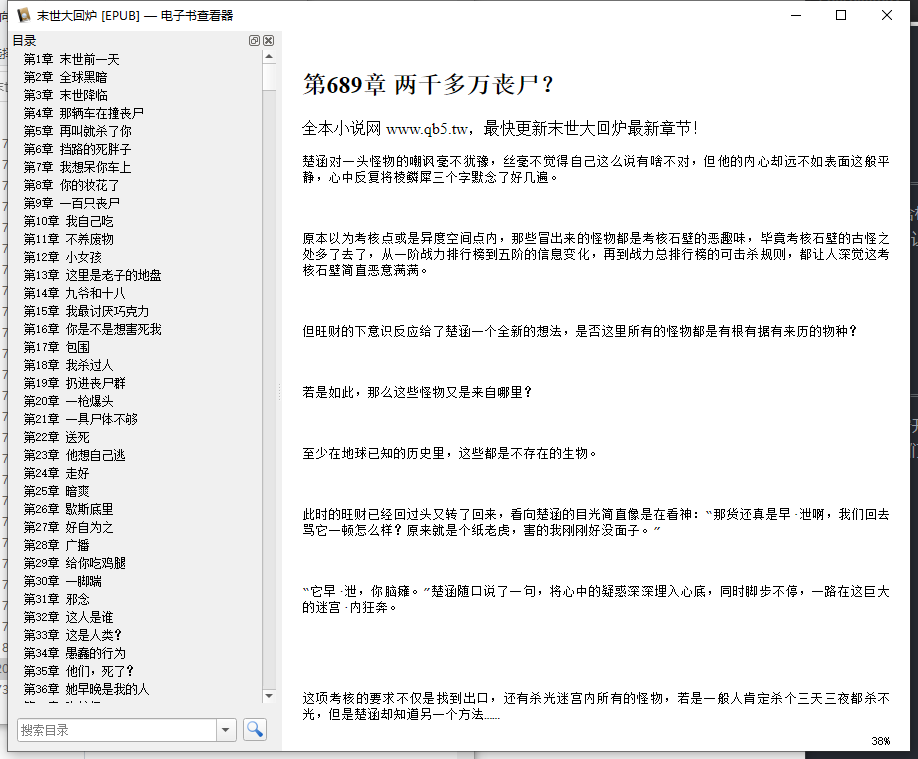

# 欢迎使用txtTranslateEPUB

`txtTranslateEPUB`是一个基于`pypandoc`的自动化项目,主要用于实现大量的txt文件合成成一个包含标题的可阅读`.epub`文件,解决新手 Pythoner 学会了爬虫，爬了整本小说却发现阅读起来异常困难的问题，让每一个刚学爬虫的萌新也可以体验到阅读自己爬取小说的成就感

## 📅展示

> 转换前

> 转换后

> 界面友好

## 📃免责声明

本项目为Python学习交流的开源非营利项目，仅作为程序员之间相互学习交流之用，使用需严格遵守开源许可协议。严禁用于商业用途，禁止使用本项目进行任何盈利活动。对一切非法使用所产生的后果，我们概不负责。本项目对您如有困扰请联系我们删除。

## 📗使用方法

- 安装Python3.6+环境

- 下载并解压项目代码包
- 适用命令`pip install -r requirements.txt -t ./ `来安装项目依赖
- 在当前目录下执行`Python main.py`即可运行项目

## 🚀当前已完成以及未来更新计划

- [x]  使用Gooey搭建友好的图形化界面
- [x]  实现智能排序
- [x]  使用窗体和逻辑分离重构代码(2022-6-10)
- [x]  为打印EPUB添加基础可定制化内容
- [ ]  排序类型: 强制排序
- [ ]  排序类型: 系统默认排序
- [ ]  压缩最终输出的EPUB文件
- [ ]  添加程序自动更新
- [ ]  大章小说分章合并(目前经过测试2500章以上的超大小说在合并时会因为内存原因长时间卡顿) 

## 👨‍👨‍👦‍👦参与贡献

欢迎各位同学通过PR或者ISSUES的方式直接参与到项目中来，请注意反馈BUG需提供完整日志！

本项目源代码包含大量注释(==几乎行行都有注释==),方便第一次加入工程的人能够更加快速的上手

